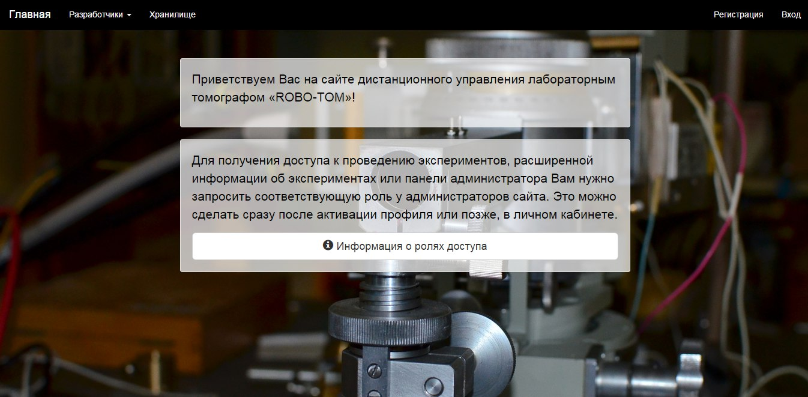

Введение
========

Сайт разработан студентами Московского Физико-Технического Института (Государственного Университета) при поддержке сотрудников Института Кристаллографии им. А.В. Шубникова Российской Академии Наук. Сайт представляет собой web-интерфейс удалённого управления лабораторным томографом с возможностью юстировки томографа, автоматизации проведения проведения экспериментов и просмотра полученных данных.

Чтобы попасть на сайт, нужно перейти в браузере по адресу http://109.234.38.83/

